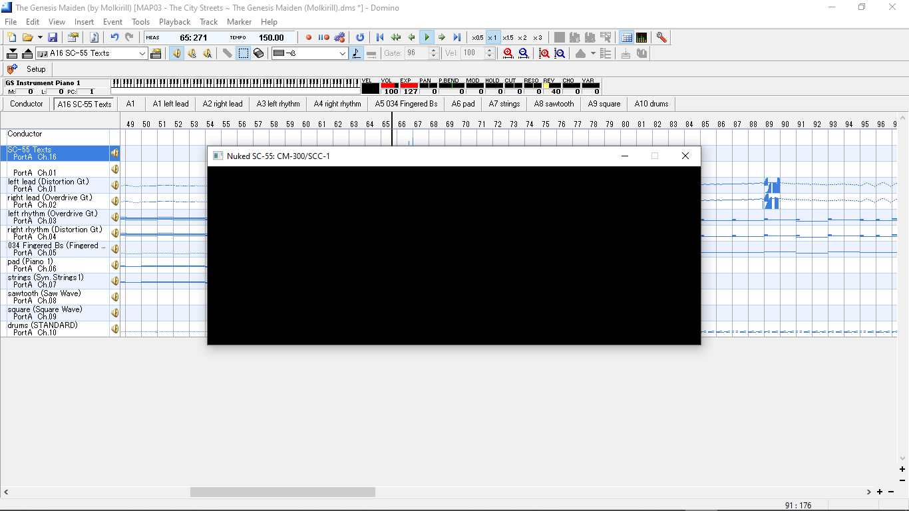

## Nuked-SoundCanvas tests

## 0.3.1

	- Nuked SC-55mkI
		- Runs: yes
		- Runs in realtime: yes
		- Tested firmwares: `v1.00`, `v1.20`, `v1.21`, `v2.00`
	
	- Nuked SC-55mkII (Firmware v1.01)
		- Runs: yes
		- Runs in realtime: no (Nuked-OPM still performs times worse, I have no idea if that's [Furnace](https://github.com/tildearrow/furnace/)
	
	- Nuked SC-155mkI:
		- Runs: yes
		- Runs in realtime: yes
		- Notes: ~~I have no idea how to communicate with it propery yet, so all MIDIs played over it are just piano and standard drum kit.~~ [1] For whatever reason, all settings related to receiving of messages were turned off so I had to switch them back on. [2] Just noticed the note on the Nuked SC-55 repo: `SC-155 doesn't reset properly on startup (firmware bug?), use Init All option to workaround this issue.`
	
	- Nuked SC-155mkII:
		- Untested, no roms
	
	- Nuked JV-880:
		- Runs: yes
		- Runs in realtime: yes
		- Tested firmwares: `v1.00`, `v1.01`
		- Notes: ~~Internal RAM read error when using internal performances.~~ <- Seems to be caused by lack of M-256E memory card emulation. Also `nuked.exe` fails to autodetect this romset.
		- Tested PCM Cards: none
		- Tested Expansions: none
	
	- Nuked CM-300/SCC-1 (v1.10):
		- Untested, incomplete set (lacks `R15199774` main mcu rom)
	
	- Nuked CM-300/SCC-1 (v1.20):
		- Untested, incomplete set (lacks `R15199774` main mcu rom)
	
	- Nuked SCC-1A:
		- Runs: yes
		- Runs in realtime: yes
		- Notes: lacks LCD:
		
	
	- Nuked SCB-55/RLP-3194:
		- Untested, incomplete set (lacks `R15199827` main mcu rom)

	- Nuked RLP-3237:
		- Untested, no rom set

	- Nuked SC-55st (v1.01):
		- Untested, no rom set

## Unknown version low-end build
	
	- Nuked SC-55mkI
		- Runs: yes
		- Runs in realtime: yes
		- Tested firmwares: `v1.00`, `v1.20`, `v1.21`, `v2.00`
	
	- Nuked SC-55mkII (Firmware v1.01)
		- Runs: yes
		- Runs in realtime: yes
	
	- Nuked JV-880
		- Runs: no
		- Tested firmwares: `v1.00`, `v1.01`
		- Notes: It does launch just fine and all, showing some unknown writes in the console. However, the display is just always empty, and the module does not accept any MIDI data nor produce any sound.

	- Nuked SC-155mkI:
		- Runs: yes
		- Runs in realtime: yes
		- Notes: ~~I have no idea how to communicate with it propery yet, so all MIDIs played over it are just piano and standard drum kit.~~ [1] For whatever reason, all settings related to receiving of messages were turned off so I had to switch them back on. [2] Just noticed the note on the Nuked SC-55 repo: `SC-155 doesn't reset properly on startup (firmware bug?), use Init All option to workaround this issue.`
	
	- Nuked SC-155mkII:
		- Untested, no roms

	- Nuked CM-300/SCC-1 (v1.10):
		- Untested, incomplete set (lacks `R15199774` main mcu rom)
		- Based on SCC-1A, I assume this is just as broken
	
	- Nuked CM-300/SCC-1 (v1.20):
		- Untested, incomplete set (lacks `R15199774` main mcu rom)
		- Based on SCC-1A, I assume this is just as broken
	
	- Nuked SCC-1A:
		- Runs: yes
		- Runs in realtime: yes
		- Notes: besides lacking the LCD here, it also completely lacks the envelopes (both volume and pitch, pitch seen on `081 Square Wave` and `082 Sawtooth Wave`) emulation. If a drum sound is played, and is interrupted by new instance of itself, it mutes new incoming note events. [This](tests/nuked-sc55-tests_what_why) is how it sounds, compared to how I [expected](midis/Others/Molkirill/genmaid_55_demo.ogg) it to sound.
	
	- Nuked SCB-55/RLP-3194:
		- Untested, incomplete set (lacks `R15199827` main mcu rom)

	- Nuked RLP-3237:
		- Untested, no rom set

	- Nuked SC-55st (v1.01):
		- Untested, no rom set